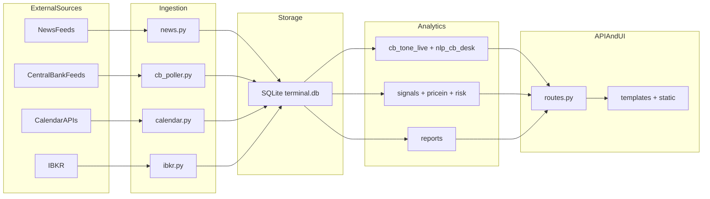

# Terminal Architecture

## Overview

This project is a modular macro-financial terminal with five core layers:

1. Ingestion: scrapers and connectors pull raw news, central bank updates, calendar data, and market data.
2. Normalization: raw payloads are mapped to stable domain objects.
3. Storage: SQLite persistence for historical replay and analytics.
4. Analytics: NLP tone, signals, risk, price-in, reports.
5. Delivery: FastAPI endpoints and browser UI.

## Module Inventory

| Module | Role | Input | Output | Dependencies | Critical |
| --- | --- | --- | --- | --- | --- |
| `scrapers/news.py` | RSS collection | Feeds/YAML | `live_articles`, DB rows | HTTP, feedparser | Yes |
| `scrapers/cb_poller.py` | CB headlines polling | CB feeds | `live_states`, DB snapshots | HTTP, optional legacy CB libs | Yes |
| `scrapers/calendar.py` | Economic calendar | FF/Investing/Finnhub | `live_calendar`, DB rows | HTTP | Yes |
| `scrapers/ibkr.py` | Market feed and candles | TWS/Gateway | live quotes/candles | ib_insync | Yes |
| `storage/sqlite_store.py` | Persistence and reads | normalized dicts | tables + history API | sqlite3 | Yes |
| `analysis/*` | Signals/risk/NLP/reports | stored and live data | analytics payloads | numpy-lite logic | Yes |
| `workers/supervisor.py` | Worker orchestration | worker callables | runtime health | threading | Yes |
| `routes.py` | API transport | app state + analytics | JSON/websocket | fastapi | Yes |
| `static/*` | Frontend rendering | API payloads | screens/charts | JS + LightweightCharts | Medium |

## Critical Dependencies

- IBKR connection availability (`scrapers/ibkr.py`)
- SQLite path and file health (`storage/sqlite_store.py`)
- Worker scheduler integrity (`workers/supervisor.py`)
- News and CB source fallback behavior (`config.py`, scrapers)

## Known Constraints

- Legacy folders may still exist locally but should not be required at runtime.
- Some analytics are heuristics and should be tagged as proxy metrics.
